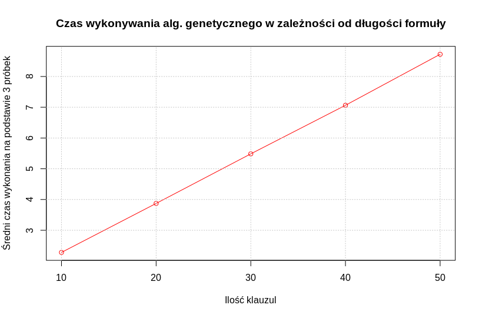

```{r setup, include=FALSE}
knitr::opts_chunk$set(echo = TRUE)
```

<style>
div.polecenie pre { background-color:lightgray; font-style:italic; }
</style>

## Wstęp
Celem zadania było rozwiązanie wybranego problemu za pomocą algorytmu genetycznego.

## Część pierwsza
<div class = "polecenie">
```
W sprawozdaniu PDF opisz chromosomy i funkcję fitness. Wskaż na najważniejsze fragmenty kodu i objaśnij je swoimi słowami. Przedstaw działanie funkcji fitness na kilku chromosomach. Mile widziane jest przetestowanie kilku funkcji fitness i wybranie najbardziej efektywnej.
```
</div>

### *Chromosom* 
to wektor zawierający zera i jedynki, które symbolizują infromacje o wartościach logicznch dla każdej zmiennej w formule 3-SAT. Element *i* w chromosomie odpowiada wartości zmiennej *x~i~* w formule logicznej. Obrazując chromosom jako np.

| L.p.    | 1 | 2 | 3 | 4 | 5 |
|---------|---|---|---|---|---|
| Wartość | 0 | 1 | 0 | 1 | 0 | 

a formułę logiczną jako np. (x~1~ ∨ x~3~ v x~2~) ∧ (x~3~ ∨ x~5~ ∨ x~4~)

po podstawieniu celem badania spełnialności formuły logicznej, utożsamiamy to z "rozumieniem" formuły w sposób następujący: (0 v 0 v 1) ∧ (0 v 0 v 1)

### *Funkcja fitness* 
to funkcja przystosowania, która w zależności od swojego kształtu, w różny sposób mówi nam o jakości danego osobnika (z punktu widzenia rozwiązywanego problemu). Dzięki funkcji fitness można np. przyznawać zadowalającym osobnikom punkty lub też wyrazić ich procentowy udział w ilości wszystkich badanych osobników.

### Funkcja fitness w prezentowanym programie: 
```
fitness3SAT <- function(chromosome) {
    score <- 0 
    # pętla przechodząca co 3 elementy (klauzulę) w wektorze klauzul
    for(i in seq(1, length(clauses_vectorized), by = 3)) { 
    
        # tymczasowy wektor dla wartości logicznych:
        tmp <- c() 
        
        # dla każdego elementu z klauzuli
        for(j in 0:2) { 
        
            if (clauses_vectorized[i+j] < 0) { 
                # jeśli element wskazuje na miejsce w chromosomie liczbą ujemną, to oznacza negację, więc trzeba 
                # znaleźć wartość bezwzględną l.p. miejsca, sprawdzić, co się 
                # kryje w chromosomie na tym miejscu i zanegować, czyli zeswapować
                tmp <- c(tmp,swap(chromosome[abs(clauses_vectorized[i+j])]))    

            } else {
                # "zwyczajne" (w porównaniu do poprzedniego) sprawdzenie wartości w chromosomie
                tmp <- c(tmp,chromosome[abs(clauses_vectorized[i+j])])  
            } 
        } 
        # tym sposobem w wktorze tmp mamy wartości logiczne, które po podstawieniu do klauzuli czynią ją spełnialną
        
        if(1 %in% tmp) { 
            # jeśli w wektorze wartości logicznych jest 1, klauzula jest spełniona
            # więc należy dodać punkt dla tej klauzuli
            score <- score + 1
        }
    } 
    # i przejść do następnej trójki
    return(-score)
}
```

### Przykład działania funkcji fitness
#### Chromosom
| L.p.    | 1 | 2 | 3 | 4 | 5 |
|---------|---|---|---|---|---|
| Wartość | 0 | 1 | 0 | 1 | 0 | 

#### Formuła 
(x~1~ ∨ ¬x~3~ v x~2~) ∧ (x~3~ ∨ x~5~ ∨ ¬x~4~)
która na potrzeby programu jest zakodowana w formie: 1 -3 2 3 5 -4

#### Objaśnienie krok po kroku
* pętla główna funkcji fitness wybiera pierwszą klauzulę: (x~1~ ∨ ¬x~3~ v x~2~)
* tworzy się tymczasowy, pusty wektor wartości logicznych 
* druga pętla funkcji fitness jest odpowiedzialna za badanie każdej ze zmiennych osobno:
    + badanie x~1~ - funkcja dostaje *1*:
        - element wskazuje na miejsce w chromosomie liczbą dodatnią
        - następuje sprawdzenie wartości widniejącej w chromosomie pod indeksem 1 
        - wartość *0* zostaje dopisana do tymczasowego wektora wartości logicznych, wektor: [0]
    + badanie ¬x~3~ - funkcja dostaje *-3*:
        - element wskazuje na miejsce w chromosomie liczbą ujemną
        - następuje sprawdzenie wartości widniejącej w chromosomie pod indeksem 3 oraz jej negacja
        - wartość *1* zostaje dopisana do tymczasowego wektora wartości logicznych, wektor: [0, 1]
    + badanie x~2~ - funkcja dostaje *2*:
        - element wskazuje na miejsce w chromosomie liczbą dodatnią
        - następuje sprawdzenie wartości widniejącej w chromosomie pod indeksem 2 
        - wartość *1* zostaje dopisana do tymczasowego wektora wartości logicznych, wektor: [0, 1, 1]
    + badanie wektora wartości logicznych: zawiera *1*, więc klauzula dostaje punkt
* pętla główna funkcji fitness wybiera drugą klauzulę: (x~3~ ∨ x~5~ ∨ ¬x~4~)
* tworzy się tymczasowy, pusty wektor wartości logicznych 
* druga pętla funkcji fitness jest odpowiedzialna za badanie każdej ze zmiennych osobno:
    + badanie x~3~ - funkcja dostaje *3*:
        - element wskazuje na miejsce w chromosomie liczbą dodatnią
        - następuje sprawdzenie wartości widniejącej w chromosomie pod indeksem 3 
        - wartość *0* zostaje dopisana do tymczasowego wektora wartości logicznych, wektor: [0]
    + badanie x~5~ - funkcja dostaje *5*:
        - element wskazuje na miejsce w chromosomie liczbą dodatnią
        - następuje sprawdzenie wartości widniejącej w chromosomie pod indeksem 5 
        - wartość *0* zostaje dopisana do tymczasowego wektora wartości logicznych, wektor: [0, 0]
    + badanie ¬x~4~ - funkcja dostaje *-4*:
        - element wskazuje na miejsce w chromosomie liczbą ujemną
        - następuje sprawdzenie wartości widniejącej w chromosomie pod indeksem 4 oraz jej negacja
        - wartość *0* zostaje dopisana do tymczasowego wektora wartości logicznych, wektor: [0, 0, 0]
    + badanie wektora wartości logicznych: nie zawiera *1*, więc klauzula nie dostaje punktu
* funkcja zwraca wynik: 1 punkt

## Część druga - analiza działania algorytmu w zależności od parametrów
<div class = "polecenie">
```
Wybierz instancję problemu (nie za dużą i nie za małą), korzystając z zasobów internetowych. Dla jakich parametrów (szansa mutacji, wielkość populacji, elityzm, rodzaj krzyżowania, rodzaj selekcji, funkcja fitness) algorytm działa najszybciej i najefektywniej? Dokonaj eksperymentów. Opisz je słownie i/lub za pomocą wykresów w sprawozdaniu PDF.
```
</div>

### Wybranie instancji problemu
Do przeanalizowania działania algorytmu genetycznego w zależności od jego parametrów wybrano instancję problemu o 50 klauzulach, stworzoną samodzielnie w sposób dokładniej opisany w części trzeciej.

### Dla jakich parametrów (szansa mutacji, wielkość populacji, elityzm, rodzaj krzyżowania, rodzaj selekcji, funkcja fitness) algorytm działa najefektywniej?

Poniższa tabela została wygenerowana podczas rozwiązywania zadania oraz zaimportowana do pliku sprawozdania. Zawiera informacje o poszczególnych parametrach algorytmu genetycznego w danej iteracji. Dane zostały posortowane malejąco, jako kryterium sortowania wybrana została ilość odnalezionych spełnialnych klauzul. Odpowiedź na pytanie zawiera zatem pierwszy wiersz oraz każdy następny z wynikiem *49*.
```{r najefektywniej, echo=FALSE}
najefektywniej <- read.csv(file="most_effective_order.csv", header=TRUE, sep=",")[ ,2:6]
names(najefektywniej) <- c("seq", "pop size", "found in iteration", "how many found", "time")
najefektywniej 
```

### Dla jakich parametrów (szansa mutacji, wielkość populacji, elityzm, rodzaj krzyżowania, rodzaj selekcji, funkcja fitness) algorytm działa najszybciej?
Poniższa tabela została wygenerowana podczas rozwiązywania zadania oraz zaimportowana do pliku sprawozdania. Zawiera informacje o poszczególnych parametrach algorytmu genetycznego w danej iteracji. Dane zostały posortowane rosnąco, jako kryterium sortowania wybrany został czas wykonania algorytmu. Odpowiedź na pytanie zawiera zatem pierwszy wiersz.
```{r najszybciej, echo=FALSE}
najszybciej <- read.csv(file="fastest_order.csv", header=TRUE, sep=",")[ ,2:6]
names(najszybciej) <- c("seq", "pop size", "found in iteration", "how many found", "time")
najszybciej
```

## Część trzecia - analiza czasu działania algorytmu w zależności od ilości klauzul
<div class = "polecenie">
```
Wybierz wiele instancji problemów o różnej złożoności korzystając z zasobów internetowych (baz danych, automatycznych generatorów łamigłówek itp.), tzn. 
- Dla formuł 3-SAT będą to formuły o różnej długości (liczbie klauzul) i liczbie zmiennych. Można rozważyć formuły o długości 10,20,40,60,80,100 klauzul.
(...)
A następnie porównaj czasy działania algorytmu genetycznego dla każdej z tych instancji. Jak szybko wzrasta czas działania algorytmu względem rozmiaru problemu? Liniowo? Zestaw dane na wykresie liniowym przyjmując na osi X wielkość problemu, a na Y czas działania algorytmu. Zinterpretuj wynik.
```
</div>

W celu wykonania tej części zadania, wygenerowane zostały zestawy formuł o długości 10, 20, 30, 40 i 50 klauzul. Każdorazowo ilość unikalnych zmiennych była dwukrotnością długości formuły - dla dł. 10 liczba zmiennych wyniosła 20, dla dł. 20 liczba zmiennych wyniosła 40 itd. Zadbano o to, aby wszystkie spośród nich były spełnialne (ręcznie skonstruowano chromosom, a następnie tak układano klauzule, aby każda z nich była spełnialna. W celu zweryfikowania 100% poprawności konstrukcji, następnie wczytano skonstruowane formuły i badano je pod kątem rozwiązywalności oraz ilości unikalnych zmiennych.) Zestawy są dostępne w folderze *samples*.

Następnie uruchomiono algorytm genetyczny dla 3 próbek każdej długości, celem oszacowania średniego czasu wykonania algorytmu. Wyniki przedstawiono na poniższym wykresie.

Dla badanych próbek długości formuły o równym skoku 10 (10, 20, 30, 40, 50) czas wykonywania algorytmu rośnie liniowo. Można przypuszczać, że czas wykonywania w ogólności rośnie liniowo, a ewentualne odchylenia wynikają z ilości unikalnych zmiennych oraz wielkości populacji, która znacząco wpływa na czas działania algorytmu.

## Spis plików w paczce
* folder *samples* zawierający zestawy spełnialnych formuł 3-SAT
* 238143-3SAT.R - plik z programem
* fastest_order.csv - plik z zestawem wyników dla podpunktu 2, posortowanych pod względem czasu
* klauzule.ods - zestaw arkuszy LibreOfiice, w których generowane były formuły
* most_effective_order.csv - plik z zestawem wyników dla podpunktu 2, posortowanych pod względem ilości spełnionych klauzul
* Sprawozdanie.html - plik .html sprawozdania wygenerowany za pomocą R Markdown
* Sprawozdanie.Rmd - plik .Rmd sprawozdania
* times.png - wykres przedstawiający czas wykonywania alg. genetycznego w zależności od długości formuły
* times_frame.csv - plik z danymi dot. czasu wykonywania alg. genetycznego w zależności od długości formuły w formie tabeli

